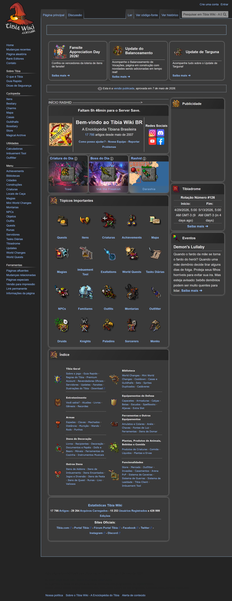
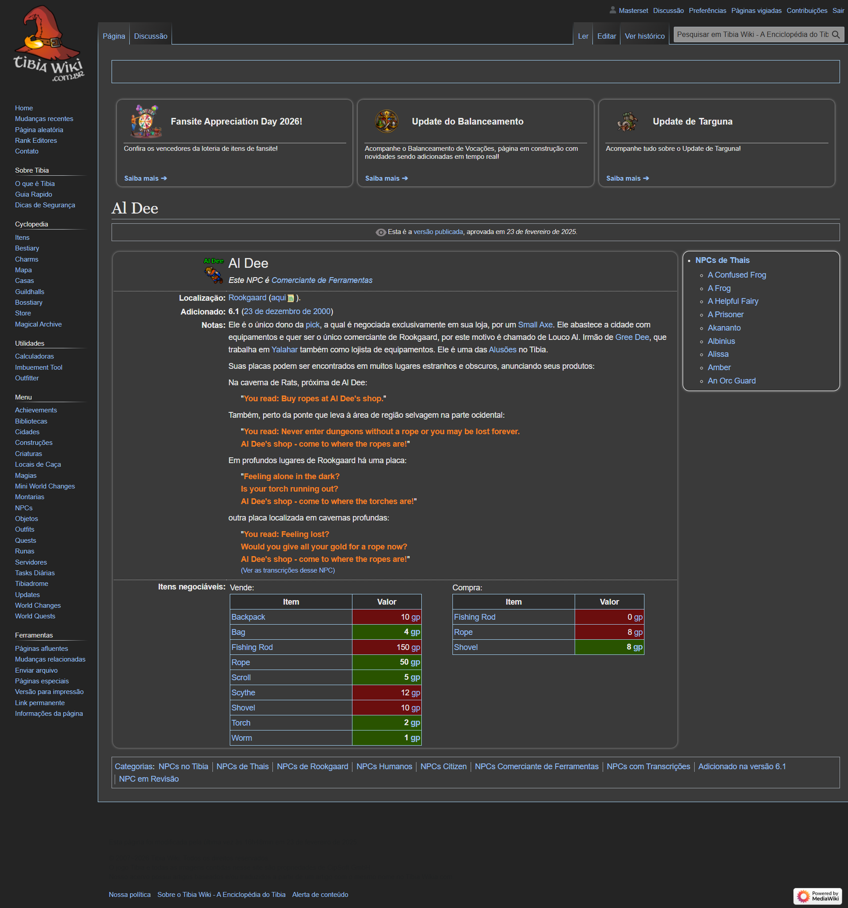
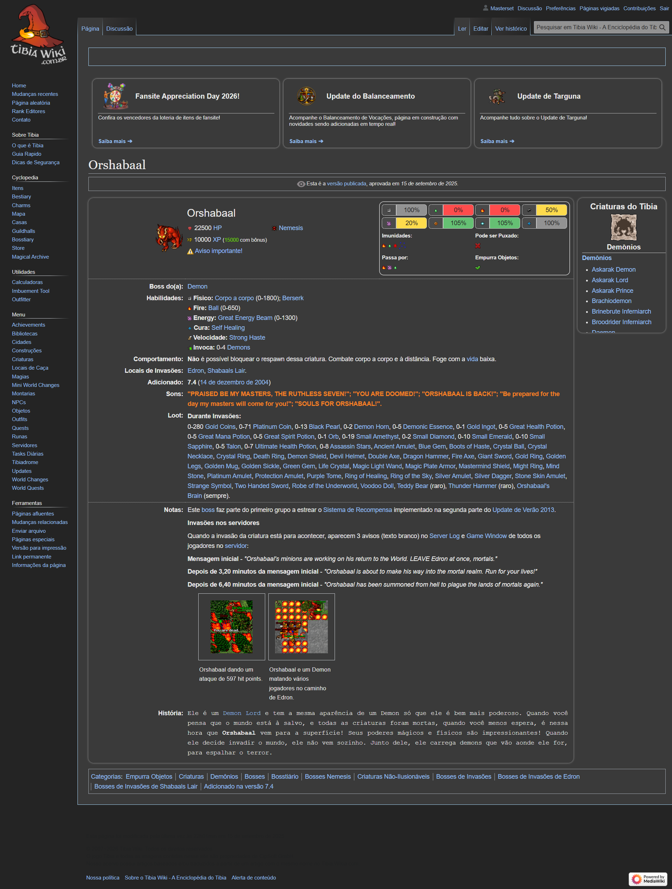
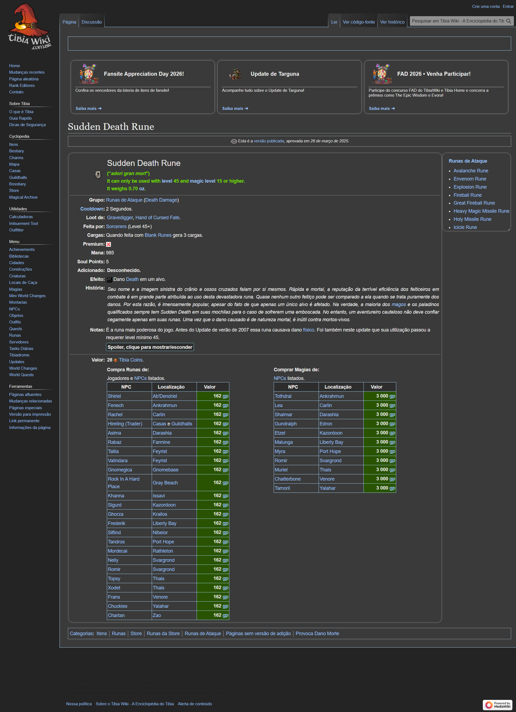
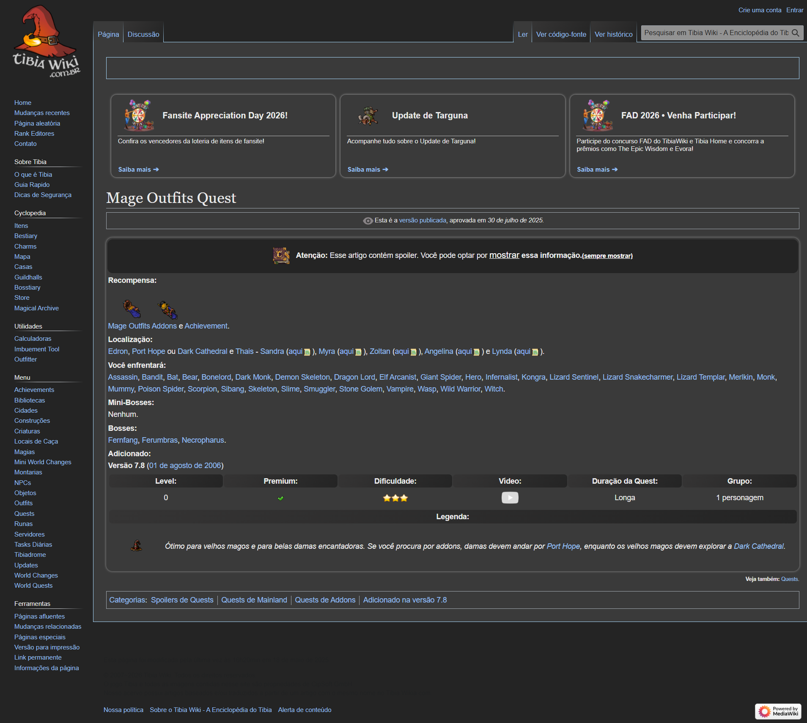

# Tibia Wiki Dark Mode

[](#)
[](LICENSE)


## Chrome Web Store

<a href="https://chrome.google.com/webstore/detail/tibia-wiki-dark-mode">

</a>

## Descrição

Extensão que ativa o modo escuro no Tibia Wiki, proporcionando melhor legibilidade e conforto visual durante longas sessões de navegação. Reduz a fadiga ocular com uma interface escura elegante e profissional.

## Recursos

- 🌙 Modo escuro completo para Tibia Wiki
- 👁️ Reduz fadiga ocular em ambientes com pouca luz
- ⚡ Carregamento rápido e sem impacto de performance
- 🎨 Design elegante e consistente
- 💾 Preferência salva automaticamente

## Como Usar

1. Instale a extensão do Chrome Web Store
2. Acesse [Tibia Wiki](https://www.tibiawiki.com.br/)
3. O modo escuro será ativado automaticamente
4. Clique no ícone da extensão para controlar as preferências

## Capturas de Tela

<picture>

</br>
<label>Tibia Wiki com modo escuro ativado</label>
</picture>
</br></br>

<picture>

</br>
<label>Página do NPC Al Dee com tema escuro</label>
</picture>
</br></br>

<picture>

</br>
<label>Navegação na página de criaturas dark mode</label>
</picture>

<picture>

</br>
<label>Exemplo de magias no dark mode</label>
</picture>

<picture>

</br>
<label>Página de outfit com a extensão ativa</label>
</picture>

## Requisitos

- Google Chrome versão 88 ou superior
- Acesso ao site [tibiawiki.com.br](https://www.tibiawiki.com.br/)

## Desenvolvimento

### Estrutura do Projeto

```
├── manifest.json          # Configuração da extensão
├── css/
│   └── night-mode.css    # Estilos do modo escuro
├── js/
│   ├── background.js     # Script de background
│   └── replace-css.js    # Script de injeção de CSS
├── icons/                 # Ícones da extensão
└── images/                # Capturas de tela
```

### Como Compilar e Testar

1. Clone o repositório
2. Abra `chrome://extensions/` no Chrome
3. Ative o "Modo do desenvolvedor"
4. Clique em "Carregar extensão não empacotada"
5. Selecione a pasta do projeto

## Licença

Este projeto está licenciado sob a Licença MIT - veja o arquivo [LICENSE](LICENSE) para mais detalhes.

## Contribuições

Contribuições são bem-vindas! Sinta-se livre para abrir issues e pull requests.
